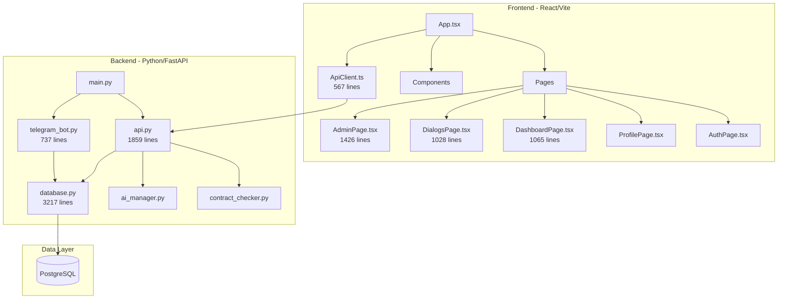
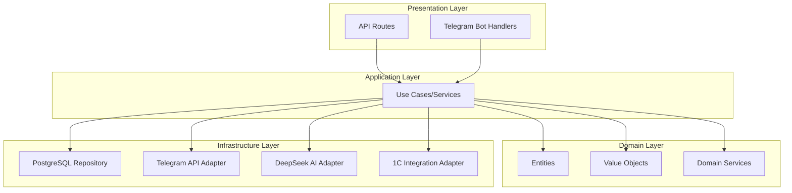

# Code Audit Report: MobileTelegramBot

**Audit Date:** February 6, 2026  
**Audited by:** Code Review Assistant

---

## Table of Contents

1. [Executive Summary](#executive-summary)
2. [Architecture Overview](#architecture-overview)
3. [Code Quality Findings](#code-quality-findings)
4. [Refactoring Recommendations](#refactoring-recommendations)
5. [Architecture Recommendations](#architecture-recommendations)
6. [Security Concerns](#security-concerns)
7. [Performance Considerations](#performance-considerations)
8. [Action Items Priority Matrix](#action-items-priority-matrix)

---

## Executive Summary

This audit examines the **MobileTelegramBot** project, a full-stack application consisting of:
- **Backend**: Python FastAPI server with PostgreSQL database and Telegram bot integration
- **Frontend**: React TypeScript web application (Vite)

### Current State Assessment

| Aspect | Rating | Notes |
|--------|--------|-------|
| Functionality | ⭐⭐⭐⭐ | Works, feature-rich |
| Code Organization | ⭐⭐ | Monolithic files, needs modularization |
| Maintainability | ⭐⭐ | Large files, tight coupling |
| Testability | ⭐ | No test structure visible |
| Security | ⭐⭐⭐ | Basic auth, some concerns |
| Performance | ⭐⭐⭐ | Acceptable, room for optimization |

---

## Architecture Overview

### Current Architecture Pattern: **Monolithic Two-Tier**



### Key Observations

1. **No clear separation of concerns** - Business logic mixed with data access
2. **Monolithic files** - Single files handling multiple responsibilities
3. **Tight coupling** - Components directly depend on each other
4. **No layered architecture** - Missing service/repository pattern

---

## Code Quality Findings

### 🔴 Critical Issues

#### 1. Massive File Sizes (God Objects)

| File | Lines | Recommendation |
|------|-------|----------------|
| `database.py` | 3,217 | Split into repositories |
| `api.py` | 1,859 | Split into routers by domain |
| `AdminPage.tsx` | 1,426 | Split into feature components |
| `DashboardPage.tsx` | 1,065 | Extract chart/stat components |
| `DialogsPage.tsx` | 1,028 | Extract modal and list components |

#### 2. Database Layer Issues (`database.py`)

```python
# Current: Everything in one file
def save_message(...): ...
def upsert_chat(...): ...
def list_chat_dialogs(...): ...
def get_dashboard_summary(...): ...
# ... 100+ more functions
```

**Problems:**
- Single module handles ALL database operations
- Raw SQL scattered throughout
- No transaction management abstraction
- Global connection with threading lock

#### 3. API Layer Issues (`api.py`)

```python
# Current: All routes in single file
@router.post("/auth/register", ...)
@router.post("/auth/login", ...)
@router.get("/chats", ...)
@router.get("/analytics/dashboard", ...)
# ... 50+ more routes
```

**Problems:**
- All 50+ endpoints in one file
- Request/Response models mixed with routes
- Business logic embedded in route handlers

### 🟡 Medium Issues

#### 4. Frontend Component Bloat

**AdminPage.tsx** contains:
- User management UI
- BIN assignment modal
- Role management
- Section management
- Password reset functionality
- Multiple modals
- All state management

This violates Single Responsibility Principle.

#### 5. Inconsistent Type Handling

```typescript
// types.ts has paired Raw/Parsed types
export interface UserProfileRaw { ... }  // snake_case from API
export interface UserProfile { ... }     // camelCase for frontend
```

Good pattern, but conversion is manual and spread across `ApiClient.ts` and `converters.ts`.

#### 6. CSS Monolith

`styles.css` is **3,607 lines** containing:
- Global resets
- Component styles
- Dark/Light theme variables
- Page-specific styles

### 🟢 Minor Issues

#### 7. Mixed Language Comments

Russian and English comments intermixed. Recommend standardizing to one language.

#### 8. Magic Numbers/Strings

```python
ONEC_CHAT_ID_OFFSET = 9_000_000_000_000
ONEC_CHAT_ID_SPACE = 1_000_000_000_000
```

Should be documented or moved to configuration.

---

## Refactoring Recommendations

### Backend Restructuring

#### Recommended Directory Structure

```
backend/
├── __init__.py
├── main.py                    # Entry point only
├── config.py                  # All configuration/env vars
│
├── api/
│   ├── __init__.py
│   ├── dependencies.py        # Auth, common deps
│   ├── routers/
│   │   ├── __init__.py
│   │   ├── auth.py            # /auth/* routes
│   │   ├── users.py           # /users/* routes  
│   │   ├── chats.py           # /chats/* routes
│   │   ├── bins.py            # /bins/* routes
│   │   ├── analytics.py       # /analytics/* routes
│   │   └── integrations.py    # /1c/* routes
│   └── schemas/
│       ├── __init__.py
│       ├── auth.py            # Auth request/response models
│       ├── users.py
│       ├── chats.py
│       └── analytics.py
│
├── services/
│   ├── __init__.py
│   ├── auth_service.py        # Business logic for auth
│   ├── chat_service.py
│   ├── user_service.py
│   ├── analytics_service.py
│   └── notification_service.py
│
├── repositories/
│   ├── __init__.py
│   ├── base.py                # Base repository class
│   ├── user_repository.py
│   ├── chat_repository.py
│   ├── message_repository.py
│   └── dialog_repository.py
│
├── models/
│   ├── __init__.py
│   ├── user.py                # Dataclasses/Pydantic models
│   ├── chat.py
│   └── message.py
│
├── integrations/
│   ├── __init__.py
│   ├── telegram/
│   │   ├── __init__.py
│   │   ├── bot.py
│   │   └── handlers.py
│   ├── ai/
│   │   ├── __init__.py
│   │   └── deepseek.py
│   └── onec/
│       ├── __init__.py
│       └── client.py
│
└── core/
    ├── __init__.py
    ├── database.py            # Connection pool, session factory
    ├── security.py            # Password hashing, token generation
    └── exceptions.py          # Custom exceptions
```

#### Example: Refactored Auth Router

```python
# backend/api/routers/auth.py
from fastapi import APIRouter, Depends
from ..dependencies import require_api_token
from ..schemas.auth import LoginRequest, RegisterRequest, AuthResponse
from ...services.auth_service import AuthService

router = APIRouter(prefix="/auth", tags=["auth"])

@router.post("/login", response_model=AuthResponse)
def login(
    request: LoginRequest,
    auth_service: AuthService = Depends(),
    _: None = Depends(require_api_token)
):
    return auth_service.authenticate(request.identifier, request.password)

@router.post("/register")
def register(
    request: RegisterRequest,
    auth_service: AuthService = Depends(),
    _: None = Depends(require_api_token)
):
    return auth_service.register_user(request)
```

#### Example: Repository Pattern

```python
# backend/repositories/user_repository.py
from typing import Optional
from ..core.database import get_session
from ..models.user import User

class UserRepository:
    def find_by_email(self, email: str) -> Optional[User]:
        with get_session() as session:
            return session.query(User).filter(User.email == email).first()
    
    def find_by_identifier(self, identifier: str) -> Optional[User]:
        with get_session() as session:
            return session.query(User).filter(
                (User.email == identifier) | (User.login == identifier)
            ).first()
    
    def create(self, user: User) -> User:
        with get_session() as session:
            session.add(user)
            session.commit()
            session.refresh(user)
            return user
```

### Frontend Restructuring

#### Recommended Directory Structure

```
webapp/src/
├── main.tsx
├── App.tsx                    # Shell, routing only
│
├── api/
│   ├── client.ts              # Base HTTP client
│   ├── endpoints/
│   │   ├── auth.ts
│   │   ├── users.ts
│   │   ├── chats.ts
│   │   └── analytics.ts
│   └── types/                 # API response types
│
├── features/
│   ├── auth/
│   │   ├── AuthPage.tsx
│   │   ├── LoginForm.tsx
│   │   ├── RegisterForm.tsx
│   │   └── useAuth.ts
│   │
│   ├── dialogs/
│   │   ├── DialogsPage.tsx
│   │   ├── components/
│   │   │   ├── ChatList.tsx
│   │   │   ├── ChatCard.tsx
│   │   │   ├── ChatDetailModal.tsx
│   │   │   ├── MessageList.tsx
│   │   │   └── MessageBubble.tsx
│   │   └── hooks/
│   │       ├── useChats.ts
│   │       └── useMessages.ts
│   │
│   ├── dashboard/
│   │   ├── DashboardPage.tsx
│   │   ├── components/
│   │   │   ├── StatCard.tsx
│   │   │   ├── ActivityChart.tsx
│   │   │   ├── SectionBreakdown.tsx
│   │   │   └── OperatorStats.tsx
│   │   └── hooks/
│   │       └── useDashboardData.ts
│   │
│   ├── admin/
│   │   ├── AdminPage.tsx
│   │   ├── components/
│   │   │   ├── UserCard.tsx
│   │   │   ├── UserList.tsx
│   │   │   ├── RoleSelector.tsx
│   │   │   ├── BinAssignment.tsx
│   │   │   ├── PendingUsers.tsx
│   │   │   └── OrganizationsTable.tsx
│   │   └── hooks/
│   │       └── useUsers.ts
│   │
│   └── profile/
│       ├── ProfilePage.tsx
│       └── components/
│
├── components/                # Shared components
│   ├── ui/
│   │   ├── Button.tsx
│   │   ├── Input.tsx
│   │   ├── Modal.tsx
│   │   ├── Badge.tsx
│   │   └── Table.tsx
│   └── layout/
│       ├── Header.tsx
│       └── TabBar.tsx
│
├── hooks/                     # Shared hooks
│   ├── useApi.ts
│   └── useDebounce.ts
│
├── context/
│   └── ApiContext.tsx
│
├── types/
│   └── index.ts
│
├── utils/
│   ├── date.ts
│   └── converters.ts
│
└── styles/
    ├── base.css               # Resets, variables
    ├── components.css         # Shared component styles
    └── themes/
        ├── light.css
        └── dark.css
```

#### Example: Extracted Component

```tsx
// features/admin/components/UserCard.tsx
import React from 'react';
import { UserProfile } from '../../../types';
import { RoleSelector } from './RoleSelector';
import { BinAssignment } from './BinAssignment';

interface UserCardProps {
  user: UserProfile;
  onRoleChange: (userId: number, role: string) => Promise<void>;
  onBinsChange: (userId: number, bins: UserBinAssignment[]) => Promise<void>;
}

export const UserCard: React.FC<UserCardProps> = ({
  user,
  onRoleChange,
  onBinsChange,
}) => {
  return (
    <div className="user-card">
      <div className="user-card__header">
        <h3>{user.name}</h3>
        <span className="badge">{user.email}</span>
      </div>
      
      <RoleSelector 
        currentRole={user.role} 
        onChange={(role) => onRoleChange(user.id, role)} 
      />
      
      <BinAssignment 
        bins={user.bins}
        onChange={(bins) => onBinsChange(user.id, bins)}
      />
    </div>
  );
};
```

---

## Architecture Recommendations

### Recommended: Clean Architecture / Hexagonal



### Key Principles to Adopt

1. **Dependency Inversion**: High-level modules shouldn't depend on low-level modules
2. **Single Responsibility**: Each module/class should have one reason to change
3. **Interface Segregation**: Clients shouldn't depend on interfaces they don't use
4. **Open/Closed**: Open for extension, closed for modification

### Database Pattern: Consider SQLAlchemy ORM

Current raw SQL approach is error-prone. Benefits of ORM:
- Type safety
- Migration support (Alembic)
- Relationship handling
- Query optimization

```python
# Example with SQLAlchemy
from sqlalchemy import Column, Integer, String, ForeignKey
from sqlalchemy.orm import relationship

class User(Base):
    __tablename__ = 'users'
    
    id = Column(Integer, primary_key=True)
    email = Column(String, unique=True, nullable=False)
    name = Column(String, nullable=False)
    role = Column(String, default='operator')
    
    sessions = relationship("Session", back_populates="user")
    bin_assignments = relationship("UserBin", back_populates="user")
```

---

## Security Concerns

### 🔴 High Priority

1. **Password Hashing**: Using SHA256 instead of bcrypt/argon2
   ```python
   # Current (Weak)
   password_hash = hashlib.sha256(request.password.encode("utf-8")).hexdigest()
   
   # Recommended
   from passlib.hash import bcrypt
   password_hash = bcrypt.hash(request.password)
   ```

2. **CORS Configuration**: Wide open
   ```python
   # Current - allows everything
   allow_origins=["*"]
   
   # Recommended - restrict to known origins
   allow_origins=["https://your-domain.com"]
   ```

3. **API Token in Environment**: Consider rotating tokens mechanism

### 🟡 Medium Priority

4. **Session Management**: No expiration visible
5. **SQL Injection Risk**: Some dynamic SQL construction
6. **Input Validation**: Strengthen Pydantic validators

---

## Performance Considerations

### Database

1. **Connection Pooling**: Single global connection is a bottleneck
   ```python
   # Use connection pool
   from sqlalchemy import create_engine
   from sqlalchemy.pool import QueuePool
   
   engine = create_engine(url, poolclass=QueuePool, pool_size=10)
   ```

2. **Index Optimization**: Review query patterns, add indexes

3. **N+1 Queries**: `list_chats_for_user` likely causes multiple queries

### Frontend

1. **Bundle Size**: Large page components increase initial load
2. **Re-renders**: Consider React.memo for list items
3. **State Management**: Local state sprawl; consider Zustand/Redux for complex state

---

## Action Items Priority Matrix

### Immediate (Week 1-2)

| Priority | Task | Effort | Impact |
|----------|------|--------|--------|
| P0 | Fix password hashing (bcrypt) | Low | High |
| P0 | Restrict CORS origins | Low | High |
| P1 | Split `database.py` into repositories | Medium | High |
| P1 | Split `api.py` into routers | Medium | High |

### Short-term (Week 3-4)

| Priority | Task | Effort | Impact |
|----------|------|--------|--------|
| P1 | Add SQLAlchemy ORM | High | High |
| P2 | Split AdminPage.tsx into components | Medium | Medium |
| P2 | Add comprehensive type exports | Low | Medium |
| P2 | Split CSS into modules | Medium | Medium |

### Medium-term (Month 2)

| Priority | Task | Effort | Impact |
|----------|------|--------|--------|
| P2 | Implement service layer | High | High |
| P2 | Add unit tests for services | High | High |
| P3 | Add API documentation (OpenAPI) | Medium | Medium |
| P3 | Implement proper logging | Low | Medium |

### Long-term (Month 3+)

| Priority | Task | Effort | Impact |
|----------|------|--------|--------|
| P3 | Add integration tests | High | Medium |
| P3 | CI/CD pipeline | Medium | Medium |
| P3 | Performance profiling & optimization | Medium | Medium |
| P4 | Consider microservices split (if scaling needed) | Very High | Context-dependent |

---

## Conclusion

The MobileTelegramBot project is functional but has accumulated technical debt that will increasingly slow development and introduce bugs. The primary issues are:

1. **Monolithic files** - Single files doing too much
2. **Missing abstraction layers** - Direct database access from routes
3. **Security gaps** - Weak password hashing, open CORS
4. **No test coverage** - High risk for regressions

Prioritize the security fixes immediately, then systematically refactor following the recommended structure. The effort will pay off in faster feature development, fewer bugs, and easier onboarding of new developers.

---

*This audit was performed based on static code analysis. Performance testing and security penetration testing are recommended for a complete assessment.*
