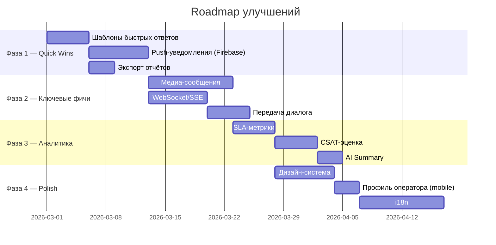

# 📋 Полный аудит проекта MobileTelegramBot — Функционал и Рекомендации

---

## 1. Текущий функционал — Полная инвентаризация

### 🤖 Telegram Bot (`telegram_bot.py`)

| # | Функция | Описание |
|---|---------|----------|
| 1 | `/start` | Приветственное сообщение, клавиатура выбора раздела |
| 2 | `/faq` | Отображение частых вопросов по разделам |
| 3 | `/ai` | Включение AI-помощника (DeepSeek) |
| 4 | `/operator` | Запрос связи с оператором |
| 5 | Разделы (`general`, `finance`, `support`, `hr`) | Переключение раздела для тематической маршрутизации |
| 6 | Выбор БИН | Меню выбора/смены организации (БИН) клиентом |
| 7 | AI-ответы | Автоматические ответы через DeepSeek с контекстом последних 4 сообщений |
| 8 | Auto-answer (FAQ) | Автоподбор ответа из FAQ по ключевым словам |
| 9 | Режим оператора | Переключение `operator_mode` — AI отключается, сообщения идут к живому оператору |
| 10 | Сохранение сообщений | Все входящие/исходящие сообщения пишутся в БД |
| 11 | Диалоги | Автоматическое создание/переоткрытие диалогов (в рамках 24ч) |
| 12 | Обращения (Appeals) | Внутри диалога создаются обращения для детальной метрики |

---

### 🔧 Backend API (`api.py` — 103 элемента)

#### Аутентификация и пользователи
| # | Эндпоинт / Кнопка | Описание |
|---|------------|----------|
| 1 | `POST /register` | Регистрация нового пользователя (ожидает одобрения) |
| 2 | `POST /login` | Вход по email/login + пароль → session token |
| 3 | `GET /me` | Получение профиля текущего пользователя |
| 4 | `PUT /me` | Обновление профиля (имя, должность, телефон, bio, email) |
| 5 | `POST /me/password` | Смена пароля (текущий + новый) |

#### Администрирование пользователей (Admin/Moderator)
| # | Эндпоинт / Кнопка | Описание |
|---|------------|----------|
| 6 | `GET /admin/users` | Список всех пользователей с поиском |
| 7 | `GET /admin/pending` | Список ожидающих регистрации |
| 8 | **Кнопка «Одобрить»** → `POST /admin/users/{id}/approve` | Одобрение регистрации |
| 9 | **Кнопка «Отклонить»** → `DELETE /admin/users/{id}/reject` | Отклонение регистрации |
| 10 | **Смена роли** → `PUT /admin/users/{id}/role` | Изменение роли (admin/moderator/operator) |
| 11 | **Сброс пароля** → `PUT /admin/users/{id}/password` | Сброс пароля пользователю |
| 12 | **Назначение разделов** → `PUT /admin/users/{id}/sections` | Привязка разделов к оператору |
| 13 | **Назначение БИНов** → `PUT /admin/users/{id}/bins` | Привязка БИНов (с датой истечения) |
| 14 | **Кнопка «Удалить»** → `DELETE /admin/users/{id}` | Удаление пользователя |
| 15 | `GET /roles` | Список доступных ролей |

#### Управление диалогами
| # | Эндпоинт / Кнопка | Описание |
|---|------------|----------|
| 16 | `GET /chats` | Список чатов/диалогов (с фильтрами favorite, bin) |
| 17 | `GET /chats/{id}/messages` | Получение сообщений чата (с фильтром по dialog_id) |
| 18 | **Кнопка «Отправить»** → `POST /reply` | Отправка ответа клиенту через Telegram |
| 19 | **Кнопка «Закрыть диалог»** → `POST /dialogs/{id}/close` | Закрытие диалога (сохраняет метрики) |
| 20 | **Кнопка «Открыть диалог»** → `POST /dialogs/{id}/open` | Переоткрытие закрытого диалога |
| 21 | **Кнопка «Вкл AI»** → `POST /dialogs/{id}/enable-ai` | Включение AI-помощника для диалога |
| 22 | **Кнопка «Выкл AI»** → `POST /dialogs/{id}/disable-ai` | Отключение AI (переход в руч. режим) |
| 23 | **Звёздочка (Избранное)** → `POST /dialogs/{id}/favorite` | Добавление в избранное |
| 24 | **Убрать избранное** → `DELETE /dialogs/{id}/favorite` | Удаление из избранного |
| 25 | **Кнопка «Удалить чат»** → `DELETE /chats/{id}` | Полное удаление чата (admin/mod) |
| 26 | **Кнопка «Удалить диалог»** → `DELETE /dialogs/{id}` | Удаление конкретного диалога (admin/mod) |

#### БИНы и контракты
| # | Эндпоинт / Кнопка | Описание |
|---|------------|----------|
| 27 | `GET /bins` | Список всех БИНов с поиском |
| 28 | `GET /bins/detailed` | БИНы с информацией о контрактах (адрес, банк) |
| 29 | `GET /bins/{bin}` | Информация о конкретном БИНе (GraphQL проверка) |
| 30 | **Кнопка «Удалить БИН»** → `DELETE /bins/{bin}` | Удаление БИНа из системы |
| 31 | `GET /bins/unassigned` | Список неназначенных БИНов |
| 32 | `GET /bins/pending` | Легаси-алиас для unassigned |
| 33 | **Синхронизация** → `POST /bins/sync-contracts` | Синхронизация БИНов с GraphQL goszakup.gov.kz |
| 34 | `GET /organizations/without-contracts` | Организации без действующих договоров |

#### Интеграция с 1С
| # | Эндпоинт / Кнопка | Описание |
|---|------------|----------|
| 35 | `POST /integrations/1c/message` | Приём сообщения от 1С (создание чата/диалога) |
| 36 | `GET /integrations/1c/history` | История сообщений для 1С |
| 37 | `POST /integrations/1c/history` | То же самое через POST |
| 38 | `GET /integrations/1c/outbox` | Очередь сообщений для 1С |
| 39 | `POST /integrations/1c/ack` | Подтверждение доставки / ошибки |
| 40 | **Кнопка «Завершить обращение»** → `POST /integrations/1c/close` | Закрытие диалога из 1С |

#### Прочее
| # | Эндпоинт | Описание |
|---|----------|----------|
| 41 | `GET /sections` | Список разделов (general, finance, support, hr) |
| 42 | `GET /faq` | Список FAQ |
| 43 | `GET /dashboard/summary` | Сводная аналитика (с фильтрами по оператору и датам) |
| 44 | `GET /updates` | Long-polling обновлений (новые сообщения, статусы, уведомления) |
| 45 | `GET /health` | Healthcheck |
| 46 | `/kabinet/*` | Кабинет сотрудника (отдельный router) |

---

### 📊 Dashboard / Аналитика (`DashboardPage.tsx` + `dashboard_view.dart`)

| # | Компонент / Метрика | Описание |
|---|---------------------|----------|
| 1 | **KPI-карточки** | Всего диалогов, открытых, закрытых, ботом закрытых |
| 2 | **Сообщения** | Общее количество, входящие, исходящие |
| 3 | **Среднее время отклика** | Среднее время ответа оператора (мин.) |
| 4 | **Диаграмма по разделам** (Donut/Pie) | Распределение диалогов по разделам |
| 5 | **Топ вопросов по разделам** | Наиболее популярные вопросы клиентов |
| 6 | **Таблица операторов** | Имя, кол-во диалогов, сообщений, ср. время отклика, ECharts-бары |
| 7 | **График активности** (Line chart) | Диалоги и входящие сообщения по дням |
| 8 | **Тепловая карта нагрузки** (Heatmap) | Загрузка по дням недели × часам |
| 9 | **Топ БИНов с договорами** | Самые активные организации |
| 10 | **Фильтр по оператору** | Персональная аналитика по сотруднику |
| 11 | **Пресеты периодов** | Сегодня, Вчера, 7 дней, 30 дней, 90 дней, Произвольный |
| 12 | **Вкладки** | Обзор, Операторы, Разделы, Активность |
| 13 | **Скорость ответов** (speed buckets) | Быстрый/Средний/Медленный отклик |

---

### 🌐 Webapp (React/TSX, Vite)

| # | Страница | Основные кнопки и функции |
|---|----------|--------------------------|
| 1 | **AuthPage** | Вход (email/login + пароль), Регистрация (имя, email, пароль) |
| 2 | **DialogsPage** | Список диалогов, фильтры (статус, раздел, БИН, избранное), поиск, сортировка, RegionActivityMap, открытие чата |
| 3 | **ChatDetailModal** | Просмотр сообщений, отправка ответа, ⭐ избранное, закрыть/открыть диалог, вкл/выкл AI |
| 4 | **DashboardPage** | Полная аналитика (см. раздел выше), ECharts графики |
| 5 | **AdminPage** | Управление пользователями: одобрить/отклонить, роли, секции, БИНы, сброс пароля, удалить. Управление БИНами: все/без/с договорами, неназначенные, синхронизация, назначение |
| 6 | **ProfilePage** | Редактирование профиля (имя, должность, телефон, bio), смена пароля |
| 7 | **Навигация** | Sidebar: Диалоги, Дашборд, Админ (admin/mod), Профиль + Тёмная/Светлая тема |

#### Ключевые компоненты
| Компонент | Назначение |
|-----------|-----------|
| `RegionActivityMap` | Карта Казахстана (SVG + GeoJSON) с drilldown до областей/районов |
| `EChartsWrapper` | Обёртка для ECharts графиков |
| `SelectPill` | Кастомный выпадающий фильтр |
| `StarButton` | Кнопка избранного (⭐) |
| `ConfirmModal` | Модальное окно подтверждения (удаление и пр.) |
| `DialogCard` | Карточка диалога в списке |
| `AdminUserCard` | Карточка пользователя в админке |
| `Modal` | Базовый модальный компонент |

---

### 📱 Mobile App (Flutter/Dart)

| # | Экран | Основные функции |
|---|-------|-----------------|
| 1 | **AuthScreen** | Вход/Регистрация |
| 2 | **ChatListScreen** | Список диалогов, фильтры (статус, секция, БИН, избранное), поиск, сортировка, свайп-действия (AI, статус, удалить), skeleton/shimmer при загрузке |
| 3 | **ChatDetailScreen** | Просмотр/отправка сообщений, ⭐ избранное, закрыть/открыть диалог, вкл/выкл AI, удалить чат, auto-scroll |
| 4 | **DashboardView** | KPI-карточки, Donut-диаграммы (разделы, скорость), таблица операторов, line chart, shimmer-загрузка, фильтры (период, оператор, вкладки) |
| 5 | **AdminUserManagementView** | Полное управление: пользователи, роли, секции, БИНы, BottomSheet'ы (все БИНы, без договоров, с договорами, ненназначенные), поиск, удаление, сброс пароля |
| 6 | **OperatorProfileView** | Профиль оператора (заглушка 770 bytes) |
| 7 | **BottomBar** | Навигация: Чаты, Дашборд, Админ, Профиль |

---

### ⚙️ Инфраструктура

| Компонент | Технология |
|-----------|-----------|
| БД | PostgreSQL (connection pooling, thread-safe) |
| AI | DeepSeek (через OpenAI SDK) |
| Контракты | goszakup.gov.kz GraphQL API |
| Бот | telebot (pyTelegramBotAPI) |
| API | FastAPI + CORS |
| Фронт | React + TypeScript + Vite + ECharts |
| Мобилка | Flutter (Dart) |
| Интеграция | 1C через outbox/inbox HTTP API |

---

## 2. 🚀 Рекомендации по улучшениям

### 🔴 Критичные / Высокий приоритет

#### Функционал

| # | Улучшение | Текущее состояние | Что даст |
|---|-----------|-------------------|----------|
| 1 | **📷 Медиа-сообщения (фото, видео, голосовые)** | Только текст | Клиенты смогут отправлять скриншоты, документы. Резко повысит удобство поддержки |
| 2 | **🔔 Push-уведомления для мобилки** | Нет (только polling) | Операторы не пропустят сообщения. Критично для SLA |
| 3 | **WebSocket / SSE для webapp** | Long-polling `GET /updates` | Мгновенные обновления вместо задержки 3-5 сек |
| 4 | **🔒 JWT-токены вместо session token** | Простой session token в БД | Масштабируемость, refresh tokens, expiration |
| 5 | **📝 Шаблоны быстрых ответов** | Операторы вручную набирают типовые ответы | Экономия 30-40% времени оператора |

#### Аналитика

| # | Улучшение | Текущее состояние | Что даст |
|---|-----------|-------------------|----------|
| 6 | **📈 SLA-метрики** | Нет | Процент диалогов с ответом за < 5 мин, < 15 мин, > 1 ч. Контроль качества |
| 7 | **📊 Экспорт в Excel/PDF** | Нет выгрузки | Руководители смогут формировать отчёты |
| 8 | **🔁 CSAT-оценка (удовлетворённость)** | Нет обратной связи | Автоматический опрос после закрытия диалога → метрика NPS/CSAT |

---

### 🟡 Средний приоритет

#### Функционал

| # | Улучшение | Описание |
|---|-----------|----------|
| 9 | **📌 Внутренние заметки к диалогу** | Операторы оставляют комментарии, видимые только команде (не клиенту) |
| 10 | **👥 Передача диалога другому оператору** | Кнопка «Передать» → выбор оператора → автоуведомление |
| 11 | **🏷️ Теги/метки для диалогов** | Ручная классификация: «возврат», «срочно», «договор» и пр. |
| 12 | **⏰ Автозакрытие неактивных диалогов** | Если нет ответа от клиента 24/48ч → автоматическое закрытие с уведомлением |
| 13 | **🔍 Полнотекстовый поиск по сообщениям** | Поиск по содержимому сообщений (сейчас поиск только по чатам/БИНам) |
| 14 | **📋 Canned responses / Макросы** | БД шаблонов с категориями, вставка по `/шаблон` или кнопке |
| 15 | **👁️ Индикатор «набирает текст»** | Клиент видит, что оператор печатает ответ |
| 16 | **📊 Funnel-аналитика** | Воронка: пришёл → выбрал раздел → задал вопрос → AI ответил → оператор → решено |

#### Визуал (Webapp)

| # | Улучшение | Описание |
|---|-----------|----------|
| 17 | **🎨 Дизайн-система** | Унифицировать компоненты: кнопки, карточки, цвета. Сейчас CSS разнородный |
| 18 | **📱 Responsive design** | Адаптация Dashboard для планшетов и мобильных экранов |
| 19 | **💬 Bubble-стиль для сообщений** | Современные «пузыри» (как в Telegram/WhatsApp) вместо плоского списка |
| 20 | **🔔 Toast-уведомления** | При получении нового сообщения — всплывающее уведомление в углу |
| 21 | **Аватары операторов** | Фото/инициалы вместо текстовых имён |
| 22 | **Skeleton-loading (webapp)** | Shimmer-эффект при загрузке (как в мобилке — на вебе нет) |

#### Визуал (Mobile)

| # | Улучшение | Описание |
|---|-----------|----------|
| 23 | **OperatorProfileView — доработать** | Сейчас заглушка (770 bytes). Нужен полноценный профиль как в webapp |
| 24 | **Пустые состояния (Empty states)** | Красивые иллюстрации при отсутствии данных ("Нет диалогов" и пр.) |
| 25 | **Haptic feedback** | Тактильная отдача при свайп-действиях |
| 26 | **Анимации переходов** | Hero-анимации при открытии чата |

---

### 🟢 Низкий приоритет / Улучшения качества жизни

#### Функционал

| # | Улучшение | Описание |
|---|-----------|----------|
| 27 | **🌍 Мультиязычность (i18n)** | Казахский/Русский/Английский интерфейс |
| 28 | **📅 Календарь активности** | GitHub-стиль heatmap: активность за весь год |
| 29 | **🤖 AI-summary диалога** | Автоматическое краткое описание диалога при закрытии |
| 30 | **📊 Сравнение периодов** | «Этот месяц vs прошлый месяц» на дашборде |
| 31 | **🔗 Deeplink в Telegram** | Из уведомления в мобилке → прямой переход в нужный чат |
| 32 | **📤 Bulk-действия** | Массовое закрытие/удаление диалогов через чекбоксы |
| 33 | **🔄 Автоматический FAQ-builder** | AI анализирует частые вопросы и предлагает новые FAQ записи |
| 34 | **📈 AI Performance dashboard** | Метрики AI: % правильных ответов, % переводов на оператора, avg satisfaction |
| 35 | **💾 Бэкапы и аудит-лог** | Журнал действий администраторов (кто что сделал) |
| 36 | **🔐 2FA (двухфакторная аутентификация)** | Для админов и модераторов |

#### Аналитика — продвинутая

| # | Улучшение | Описание |
|---|-----------|----------|
| 37 | **📊 Когортный анализ** | Поведение клиентов по когортам (первое обращение, повторные) |
| 38 | **⏱️ SLA-дашборд** | Отдельная страница: SLA-нарушения, тренды, алерты |
| 39 | **🗺️ Тепловая карта по карте** | Совместить RegionActivityMap + тепловую карту нагрузки по географии |
| 40 | **📉 Churn-предсказание** | AI определяет клиентов, которые могут уйти (по паттерну обращений) |

---

## 3. ⚠️ Технический долг (обнаружено при ревью)

| # | Проблема | Где | Влияние |
|---|---------|-----|---------|
| 1 | `api.py` — 2043 строки в одном файле | Backend | Сложность поддержки. Разбить на модули: `auth.py`, `dialogs.py`, `admin.py`, `onec.py`, `dashboard.py` |
| 2 | `database.py` — 4075 строк | Backend | Монолит. Разбить по доменам: `users_db.py`, `chats_db.py`, `dialogs_db.py`, `bins_db.py` |
| 3 | Нет тестов | Весь проект | Ноль unit/integration тестов. Критично для стабильности |
| 4 | Hardcoded год «2026» в `contract_checker.py` | Backend | При смене года перестанет работать |
| 5 | `OperatorProfileView` — заглушка | Mobile | Неполный экран профиля |
| 6 | Polling вместо WebSocket | Backend + Frontend | Высокая нагрузка, задержки обновлений |
| 7 | SQL в строках (без ORM) | `database.py` | Риск SQL-injection, сложность рефакторинга |
| 8 | Нет rate limiting на API | Backend | Уязвимость к DDoS и brute-force |

---

## 4. 🎯 Рекомендуемый порядок реализации

> **Совет:** Начните с Фазы 1 — шаблоны и push-уведомления дадут максимальный эффект при минимальных усилиях.
